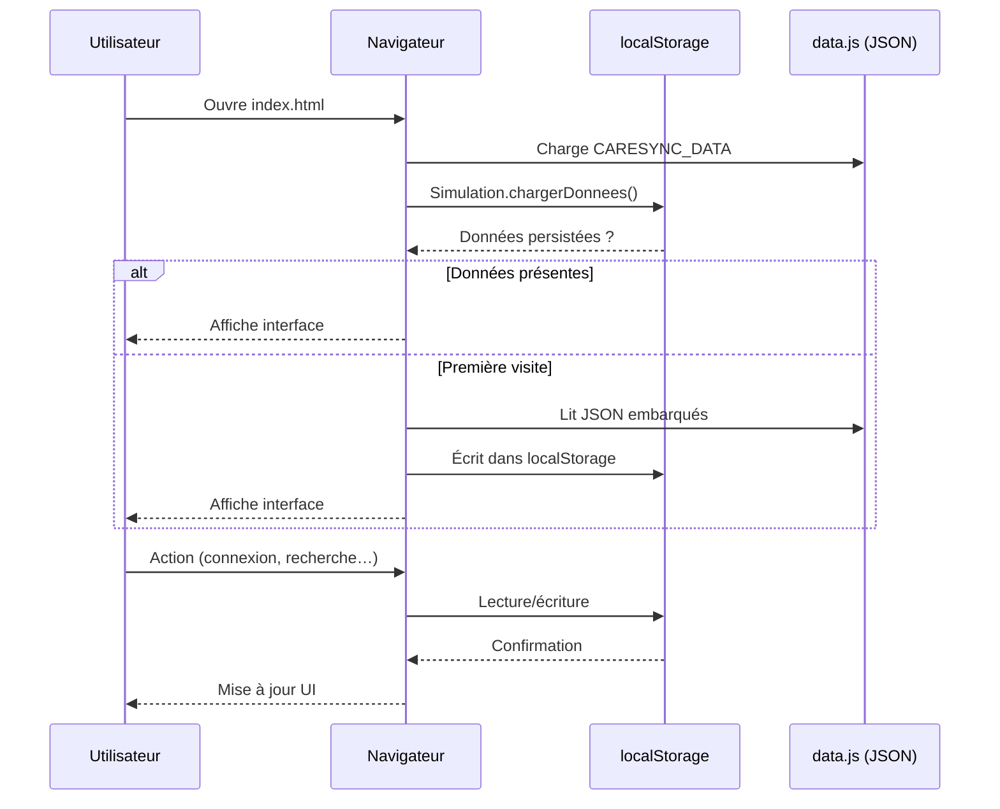

<div align="center">


# CareSync EHR

### Dossier Médical Électronique du Burkina Faso — Prototype pédagogique

**Centraliser. Sécuriser. Coordonner.** Le parcours de soins burkinabè à l'ère du numérique.

[](./LICENSE)
[](https://developer.mozilla.org/fr/docs/Glossary/HTML5)
[](https://tailwindcss.com/)
[](https://developer.mozilla.org/fr/docs/Web/JavaScript)
[](https://www.w3.org/WAI/standards-guidelines/wcag/)
[](https://sante.gov.bf/)

**Groupe 6 · Web Design · Burkina Institute of Technology**
**Année académique 2025–2026**

</div>

---

## Sommaire

- [ Présentation du projet ](#-présentation-du-projet)
- [ Vision pédagogique ](#-vision-pédagogique)
- [ Attrait pour les acteurs de santé ](#-attrait-pour-les-acteurs-de-santé)
- [ Architecture technique ](#-architecture-technique)
- [ Stack technologique ](#-stack-technologique)
- [ Fonctionnalités par rôle ](#-fonctionnalités-par-rôle)
- [ Logique médicale intégrée ](#-logique-médicale-intégrée)
- [ Données embarquées ](#-données-embarquées)
- [ Démarrage rapide ](#-démarrage-rapide)
- [ Comptes de démonstration ](#-comptes-de-démonstration)
- [ Sécurité, conformité et accessibilité ](#-sécurité-conformité-et-accessibilité)
- [ Structure du dépôt ](#-structure-du-dépôt)
- [ Membres du Groupe 6 ](#-membres-du-groupe-6)
- [ Ressources et sources documentaires ](#-ressources-et-sources-documentaires)
- [ Remerciements ](#-remerciements)
- [ Licence ](#-licence)

---

## 📋 Présentation du projet

**CareSync EHR** (Electronic Health Records) est un prototype pédagogique de dossier médical électronique national conçu pour le contexte sanitaire du **Burkina Faso**. Le projet simule une plateforme centralisée qui regroupe l'historique médical de chaque patient burkinabè, sécurise les prescriptions électroniques et coordonne les soins entre toutes les structures sanitaires du territoire, du CSPS de village au CHU régional.

Développé en HTML5, Tailwind CSS et JavaScript **vanilla** (sans framework, sans dépendance npm, sans build step), ce prototype s'exécute directement dans le navigateur. Toutes les données sont fictives et embarquées côté client : il fonctionne aussi bien en ouvrant `index.html` par double-clic qu'en servant le dossier via un serveur HTTP local. La persistance est assurée par le `localStorage` du navigateur, ce qui permet à chaque visiteur de manipuler le prototype sans aucune installation.

Le projet s'inscrit explicitement dans le cadre de la **Stratégie Nationale de Développement Sanitaire Numérique (SNDSN) 2023-2027** du Burkina Faso. Il met en scène trois rôles métier distincts — **patient**, **médecin** et **administrateur ministériel** — chacun doté d'une interface et de privilèges dédiés, afin de refléter fidèlement la réalité du parcours de soins burkinabè et la chaîne de confiance qui relie le citoyen au praticien et à l'État.

### Pourquoi ce projet ?

Le Burkina Faso fait face à plusieurs défis sanitaires structurels : fragmentation de l'information médicale entre structures, perte d'antécédents lors du transfert d'un patient d'un CMA vers un CHR, prescription d'ordonnances papier facilement falsifiables, et difficulté à anticiper les risques génétiques familiaux comme la drépanocytose — endémique en Afrique de l'Ouest. CareSync EHR propose une réponse numérique cohérente à ces problématiques, tout en restant un support d'apprentissage pour les étudiants en Web Design.

### Caractéristiques clés

| Caractéristique | Détail |
|---|---|
| **Multi-rôles** | Patient · Médecin · Administrateur ministériel |
| **Sans serveur** | 100 % client-side, données embarquées dans `assets/js/data.js` |
| **Données réalistes** | 120 patients, 40 médecins, 64 structures, 82 médicaments vérifiés |
| **Logique médicale** | Compatibilité ABO, transmission drépanocytose (Mendel), analyse familiale |
| **Accessibilité** | Conforme WCAG AA, navigation clavier, ARIA, contrastes validés |
| **Sécurité** | Échappement XSS systématique, journal d'audit, codes ministère à usage unique |
| **Volume de code** | ~14 000 lignes — 18 pages HTML, 11 modules JS, 1 643 lignes CSS |

---

## 🎓 Vision pédagogique

CareSync EHR a été pensé comme un **terrain d'apprentissage complet** pour le cours de Web Design du **Burkina Institute of Technology**. Il dépasse le simple exercice de mise en page pour offrir une problématique réelle : concevoir une interface web qui sert l'intérêt général, dans un domaine (la santé) où la moindre erreur d'ergonomie peut avoir des conséquences critiques.

Le projet a permis aux membres du groupe d'aborder, de façon concrète et interdépendante, les compétences suivantes :

- **Conception centrée utilisateur** — trois personas (patient, médecin, administrateur) aux besoins antagonistes qu'il a fallu réconcilier dans une expérience cohérente. Le patient veut de la simplicité, le médecin de l'efficacité, l'administrateur de la visibilité.
- **Design système** — élaboration d'une palette sémantique complète (primary / danger / gold / info / admin), d'une bibliothèque d'icônes SVG inline inspirée de Lucide, et de composants réutilisables (cards, badges, boutons, toasts) dans une feuille de style de 1 643 lignes.
- **Architecture front-end** — découpage modulaire du JavaScript en 11 modules à responsabilité unique (storage, auth, simulation, recherche intelligente, logique familiale, notation par cœurs, menus repliables…), sans framework et sans transpilation.
- **Persistance côté client** — utilisation raisonnée du `localStorage` avec préfixe `csm_`, gestion des quotas, fallback gracieux, sérialisation JSON et mécanisme de réinitialisation.
- **Logique métier complexe** — implémentation des tables de compatibilité ABO pour la transfusion, des lois de Mendel pour la transmission de l'électrophorèse (16 combinaisons de génotypes), et d'un moteur de détection des membres à risque dans une famille.
- **Accessibilité numérique** — application concrète des recommandations WCAG AA : skip link, attributs ARIA, navigation clavier complète, contrastes validés, sémantique HTML5, libellés associés aux champs de formulaire.
- **Sécurité applicative** — prévention XSS par échappement systématique via `echapperHTML()`, traçabilité des actions dans un journal d'audit (200 dernières entrées), codes ministère à usage unique avec expiration 72 heures.
- **Travail en équipe** — répartition en binômes tournants sur les modules, revues de code croisées, intégration continue via GitHub, gestion des versions et des branches.

### Compétences du référentiel BIT couvertes

| Domaine | Compétences mobilisées |
|---|---|
| **HTML5 sémantique** | Structure de page, landmarks, formulaires, validation native |
| **CSS3 / Tailwind** | Variables CSS, design tokens, responsive mobile-first, animations |
| **JavaScript ES6** | Modules IIFE, async/await, manipulation du DOM, gestion d'événements |
| **Stockage web** | `localStorage`, sérialisation JSON, gestion d'erreurs et quotas |
| **API Web** | `fetch`, géolocalisation (plannifiée), `Web Storage`, SVG dynamique |
| **Données structurées** | Conception de schémas JSON, génération de datasets réalistes |
| **UX / UI Design** | Personas, parcours utilisateur, design system, prototypage |
| **Accessibilité** | WCAG AA, ARIA, navigation clavier, contraste, lecteurs d'écran |
| **Sécurité web** | Prévention XSS, validation des entrées, journalisation |
| **Méthodologie** | Git, GitHub, travail collaboratif, revue de code |

---

## 🌍 Attrait pour les acteurs de santé

CareSync EHR n'est pas qu'un exercice technique : il modélise une chaîne de valeur complète qui parle à chacun des acteurs réels du système de santé burkinabè. Voici pourquoi ce prototype est directement pertinent pour chacun d'entre eux, sur la base des orientations de la SNDSN 2023-2027 et des recommandations de l'OMS.

### Pour le patient citoyen

Le patient devient acteur de sa propre santé. Il accède à **tout son historique médical** en un seul endroit — consultations, ordonnances, vaccins, allergies, antécédents familiaux — au lieu de porter un carnet papier souvent perdu ou illisible. La **carte d'urgence** affiche instantanément le groupe sanguin, l'électrophorèse et les allergies critiques, informations vitales en cas d'accident. La **personne de confiance** désignée par le patient peut accéder au dossier en cas d'urgence, ce qui répond à un besoin réel exprimé par les familles burkinabè. Enfin, la **gestion familiale** permet de visualiser les risques génétiques (drépanocytose) et d'identifier les donneurs sanguins compatibles au sein de la parentèle.

### Pour le médecin praticien

Le médecin gagne en efficacité et en sécurité juridique. La **recherche intelligente** lui permet de retrouver un patient par nom, prénom, identifiant BFA, numéro de CIN ou téléphone, avec un scoring de pertinence et un autocomplete en 200 ms. La **base de 82 médicaments vérifiés** par le ministère de la Santé et l'Ordre des Pharmaciens du Burkina Faso lui fournit instantanément la posologie adulte et enfant, les contre-indications, les effets indésirables, le prix en FCFA et le taux de remboursement. L'**analyse familiale automatique** calcule en temps réel le risque de drépanocytose pour un enfant à naître selon les lois de Mendel. Les **ordonnances certifiées** portent un tampon virtuel et un code ministère, ce qui élimine le risque de falsification. La vue **confidentielle** distingue explicitement les informations biologiques des informations adoptives, protégeant la vie privée des patients adoptés.

### Pour le ministère de la Santé

L'administrateur ministériel dispose d'un **tableau de bord stratégique** avec KPI en temps réel : nombre d'inscriptions par jour, part des médecins validés, signalements de fraudes, occupation des structures. La **détection automatique de fraudes** identifie les doublons d'agrément et les comptes suspects, ce qui est crucial dans un pays où les faux médecins sont une préoccupation récurrente. Le **journal d'audit complet** (200 dernières entrées) garantit la traçabilité de toutes les actions sensibles, exigence fondamentale pour la conformité réglementaire. La **modération des avis patients** (système BETA de notation par cœurs SVG) permet de piloter la qualité des soins au niveau national. La **génération de codes ministère** à usage unique avec expiration 72 heures sécurise le processus d'inscription de bout en bout.

### Pour les structures sanitaires

Du CHU Yalgado Ouédraogo au CSPS de village, toutes les structures sanitaires du Burkina Faso sont référencées dans le prototype (64 structures couvrant les 13 régions du pays). L'**interopérabilité** simulée permet de transférer un dossier d'une structure à l'autre sans rupture du parcours de soins, ce qui résout une douleur réelle vécue quotidiennement par les patients transférés d'un district sanitaire à un autre.

### Pour la santé publique

CareSync EHR s'aligne sur les **Objectifs de Développement Durable (ODD)** de l'ONU, en particulier l'ODD 3 « Bonne santé et bien-être » et l'ODD 9 « Industrie, innovation et infrastructure ». En centralisant les données de santé, la plateforme ouvre la voie à une **épidémiologie en temps réel** : detection précoce des épidémies, suivi de la couverture vaccinale, surveillance de la résistance aux antimicrobiens. Ces capacités, même simulées dans notre prototype, montrent la voie vers un système d'information sanitaire national robuste.

---

## 🏗 Architecture technique

L'architecture de CareSync EHR repose sur un principe fort : **séparation stricte des responsabilités** entre données, logique métier et présentation. Bien qu'il s'agisse d'un prototype sans backend, la discipline d'architecture appliquée correspond à celle d'une application de production.

### Vue d'ensemble

```
┌──────────────────────────────────────────────────────────────────┐
│                       NAVIGATEUR UTILISATEUR                       │
├──────────────────────────────────────────────────────────────────┤
│  Couche Présentation (index.html + 18 pages HTML)                │
│  ├─ Tailwind CSS (CDN) + style.css (1 643 lignes, design system) │
│  ├─ SVG inline (bibliothèque d'icônes Lucide-style, 80+ icônes)  │
│  └─ Accessibilité : skip link, ARIA, navigation clavier          │
├──────────────────────────────────────────────────────────────────┤
│  Couche Logique Métier (11 modules JavaScript vanilla ES6)       │
│  ├─ app.js              — config Tailwind + rendus partagés      │
│  ├─ auth.js             — authentification multi-rôles          │
│  ├─ simulation.js       — moteur de démonstration               │
│  ├─ intelligent-search.js — recherche multi-critères + scoring  │
│  ├─ medicament-search.js — autocomplete pharmacologique         │
│  ├─ family-health.js    — ABO + Mendel + analyse familiale      │
│  ├─ hearts-rating.js    — notation médecins (cœurs SVG)         │
│  ├─ collapsible-menus.js — menus repliables accessibles         │
│  ├─ storage.js          — persistance localStorage (wrapper)    │
│  ├─ utils.js            — fonctions utilitaires + échappement   │
│  └─ data.js             — données préchargées (474 Ko JSON)     │
├──────────────────────────────────────────────────────────────────┤
│  Couche Données (10 fichiers JSON source → data.js compilé)      │
│  ├─ patients.json (120)        ├─ medicaments.json (82)         │
│  ├─ medecins.json (40)         ├─ ordonnances.json (50)         │
│  ├─ structures.json (64)       ├─ familles.json (25)            │
│  ├─ consultations.json (80)    ├─ avis-medecins.json (476)      │
│  ├─ regions.json (13)          └─ beta-testeurs.json (3)        │
├──────────────────────────────────────────────────────────────────┤
│  Couche Persistance (localStorage navigateur, préfixe csm_)      │
│  ├─ Identifiants normalisés BFA-XXX-2026-####                   │
│  ├─ Gestion des quotas QuotaExceededError                       │
│  └─ Réinitialisation complète en un clic                        │
└──────────────────────────────────────────────────────────────────┘
```

### Principes d'architecture

**1. Modules IIFE (Immediately Invoked Function Expression)** — chaque module JS est encapsulé dans une fonction auto-invoquée qui expose une API publique minimale via `window.NomModule`. Cela garantit l'absence de pollution de l'espace global et la testabilité unitaire de chaque module.

**2. Découpage par responsabilité** — un module = un métier. `storage.js` ne s'occupe que de la persistance, `auth.js` que de l'authentification, `family-health.js` que de la logique médicale familiale. Cette discipline permet de modifier une brique sans impacter les autres.

**3. Données séparées du code** — les fichiers JSON sources dans `assets/data/` sont compilés dans `assets/js/data.js` par un script Python (`scripts/build_data_js.py`) qui génère l'objet global `window.CARESYNC_DATA`. Cette séparation permet de régénérer les données sans toucher au code applicatif.

**4. Robustesse défensive** — toutes les opérations `localStorage` sont wrappées dans des `try/catch`, le `fetch` possède un fallback sur les données embarquées, et les fonctions publiques valident systématiquement leurs paramètres en entrée.

**5. Conventions d'identifiants normalisés** — chaque entité suit un format strict : `BFA-PAT-2026-0001` pour les patients, `BFA-MED-2026-0001` pour les médecins, `BFA-ADM-2026-0001` pour les administrateurs, `STR-2026-0001` pour les structures, etc. Cette normalisation facilite la recherche, le dédoublonnage et l'interopérabilité future avec un vrai backend.

### Flux de données



### Sécurité applicative

| Couche | Mesure |
|---|---|
| **XSS** | `echapperHTML()` appliqué sur toutes les entrées utilisateur rendues dans le DOM (échappe `& < > " ' /`) |
| **Authentification** | Regex stricts pour identifiants BFA, emails, téléphones (+226), codes ministère |
| **Autorisation** | Vérification du rôle à chaque action sensible (médecin requiert `statutValidation === 'validé'`) |
| **Traçabilité** | Journal d'audit circulaire (200 dernières entrées) horodaté ISO 8601 |
| **Codes ministère** | Format `MIN-(PAT|MED|ADM)-2026-XXXX`, usage unique, expiration 72 h |
| **Données sensibles** | Distinction explicite des informations biologiques vs adoptives dans le dossier patient |

---

## 🧰 Stack technologique

| Technologie | Rôle | Version / Mode |
|---|---|---|
| **HTML5** | Structure sémantique des 18 pages | Spec W3C, landmarks, ARIA |
| **CSS3** | Design system, animations, responsive | Variables CSS, 1 643 lignes |
| **Tailwind CSS** | Framework utility-first | Via CDN, config inline étendue |
| **JavaScript** | Logique applicative (11 modules) | Vanilla ES6+, sans framework |
| **localStorage API** | Persistance côté client | Wrapper `csm_` avec try/catch |
| **JSON** | Format de données (10 fichiers) | 474 Ko de données embarquées |
| **SVG inline** | Icônes et visualisations | Bibliothèque Lucide-style, 80+ icônes |
| **Fetch API** | Chargement dynamique (fallback) | Avec fallback sur `data.js` |
| **Inter** | Police de caractères Sans-Serif | Google Fonts (corps de texte) |
| **Playfair Display** | Police Serif (titres) | Google Fonts (headings) |
| **Python 3** | Génération des données | Scripts `generate_data.py`, `build_data_js.py` |
| **Git / GitHub** | Versionnement et collaboration | GitHub Flavored Markdown pour la doc |

### Pourquoi pas de framework JS ?

Le choix de JavaScript **vanilla sans framework** (ni React, ni Vue, ni Angular) est délibéré et pédagogiquement justifié :

1. **Maîtrise des fondamentaux** — les étudiants apprennent à manipuler le DOM, gérer des états, structurer du code modulaire sans abstraction.
2. **Zéro dépendance** — le prototype fonctionne sans `npm install`, sans `node_modules`, sans build step. Un double-clic sur `index.html` suffit.
3. **Lisibilité du code** — pas de couche d'abstraction ; chaque ligne de code fait ce qu'elle dit.
4. **Performance** — pas de virtual DOM, pas de hydration, pas de runtime. La page s'affiche dès que le HTML est parsé.
5. **Transférabilité** — les compétences acquises (manipulation du DOM, événements, `localStorage`) sont transférables vers n'importe quel framework.

### Pourquoi Tailwind CSS en CDN ?

Le mode CDN de Tailwind permet de bénéficier d'un framework utility-first complet sans chaîne de build, en gardant la possibilité d'étendre la configuration via `tailwind.config = { ... }` directement dans `app.js`. Cette approche est parfaite pour un prototype pédagogique où l'on veut itérer vite. Pour une mise en production, il faudrait passer à Tailwind CLI avec purge CSS pour réduire la taille du bundle.

---

## ⚙️ Fonctionnalités par rôle

### 👤 Espace Patient

| Fonctionnalité | Description |
|---|---|
| **Dossier médical complet** | Synthèse, consultations, antécédents, allergies, vaccins, ordonnances |
| **Carte d'urgence** | Affichage prioritaire : groupe sanguin, électrophorèse, allergies critiques |
| **Personne de confiance** | Désignation d'un proche autorisé à accéder au dossier en cas d'urgence |
| **Ordonnances certifiées** | Consultation des prescriptions avec tampon virtuel et code ministère |
| **Prise de rendez-vous** | Calendrier interactif, rappels, annulation |
| **Notation des médecins** | Système BETA de notation par 1 à 4 cœurs SVG (modération ministérielle) |
| **Gestion familiale** | Visualisation des parents, enfants, fratrie, électrophorèses |
| **Documents** | Téléchargement des ordonnances, certificats, résultats d'analyse |

### 🩺 Espace Médecin

| Fonctionnalité | Description |
|---|---|
| **Recherche intelligente** | Multi-critères (nom, prénom, ID BFA, CIN, téléphone) avec scoring et autocomplete |
| **Prescription électronique** | Autocomplete sur 82 médicaments vérifiés (DCI, posologie, contre-indications) |
| **Analyse familiale auto** | Risque drépanocytose selon Mendel, identification des donneurs compatibles |
| **Vue confidentielle** | Distinction adopté / biologique, protection de la vie privée |
| **File d'attente** | Gestion des consultations du jour, historique patient |
| **Codes ministère** | Génération et validation des codes d'usage unique (72 h) |
| **Certification des ordonnances** | Tampon virtuel, horodatage, signature électronique |

### 🛡 Espace Administrateur (Ministère de la Santé)

| Fonctionnalité | Description |
|---|---|
| **Tableau de bord KPI** | Inscriptions, validations, fraudes, occupation des structures en temps réel |
| **Validation des médecins** | Workflow d'approbation avec niveaux OR / ARGENT / BRONZE |
| **Modération des avis** | Système BETA : validation ou rejet des retours patients avant publication |
| **Détection de fraudes** | Doublons d'agrément, comptes suspects, signatures incohérentes |
| **Journal d'audit** | 200 dernières entrées horodatées, filtrables par utilisateur et action |
| **Gestion des codes ministère** | Génération, expiration 72 h, traçabilité des usages |
| **Statistiques d'inscription** | Graphique sur 6 mois, export CSV |

---

## 🧬 Logique médicale intégrée

CareSync EHR ne se contente pas d'afficher des données : il implémente une véritable **logique médicale** validée par les sources officielles (OMS, Haute Autorité de Santé, Protocole national BF de prise en charge de la drépanocytose).

### Compatibilité sanguine ABO pour transfusion

La table de compatibilité `COMPATIBILITE_ABO` encode toutes les combinaisons donneur → receveur. **O−** est donneur universel, **AB+** est receveur universel. Les donneurs drépanocytaires (génotypes **SS** et **SC**) sont automatiquement exclus de la liste des donneurs potentiels, conformément aux recommandations de l'OMS.

```javascript
// Extrait de family-health.js
var COMPATIBILITE_ABO = {
  'O-':  { 'O-':true, 'O+':true, 'A-':true, 'A+':true, 'B-':true, 'B+':true, 'AB-':true, 'AB+':true },
  'O+':  { 'O+':true,  'A+':true, 'B+':true, 'AB+':true },
  // ... 8 groupes sanguins × 8 receveurs
};
```

### Transmission de l'électrophorèse (lois de Mendel)

La table `TRANSMISSION_ELECTRO` couvre les **16 combinaisons possibles** de génotypes parentaux (AA, AS, AC, SS, SC, CC) et calcule pour chaque combinaison la probabilité de chaque génotype chez l'enfant. Cette logique permet d'évaluer le **risque de drépanocytose** pour un enfant à naître, maladie particulièrement prévalente au Burkina Faso.

| Parents | Enfants possibles |
|---|---|
| AA × AA | 100 % AA (aucun risque) |
| AS × AS | 25 % AA · 50 % AS · 25 % SS (**risque élevé**) |
| AS × AC | 25 % AA · 25 % AS · 25 % AC · 25 % SC (risque modéré) |
| SS × SS | 100 % SS (risque maximal) |

La fonction `evaluerRisqueDrepanocytose(electroP1, electroP2)` retourne un niveau (`faible`, `modere`, `eleve`) et un message de recommandation adapté, qui s'affiche dans le dossier patient.

### Identification des donneurs familiaux

Pour tout patient nécessitant une transfusion, le module `family-health.js` parcourt les membres de sa famille et identifie les **donneurs compatibles** (selon ABO + exclusion drépanocytaire). Le résultat est trié par proximité familiale (parents, fratrie, enfants) puis affiché avec le groupe sanguin et l'électrophorèse de chaque donneur potentiel.

---

## 📊 Données embarquées

Le prototype embarque un volume significatif de données **fictives mais réalistes**, représentatives de la démographie et du système de santé burkinabè.

| Type | Quantité | Description | Source d'inspiration |
|---|---|---|---|
| **Patients** | 120 | Profils burkinabè réalistes : enfants, adultes, seniors, femmes enceintes | Démographie INSD Burkina Faso |
| **Médecins** | 40 | Toutes spécialités, statuts variés (validés, en attente, inactifs) | Annuaire OMNS |
| **Structures sanitaires** | 64 | CHU (3), CHR (12), CMA (20), CSPS (26), Cliniques (3) | Carte sanitaire BF |
| **Régions** | 13 | Toutes les régions administratives du Burkina Faso avec provinces | INSD |
| **Familles** | 25 | Arbres généalogiques avec électrophorèses et antécédents | — |
| **Consultations** | 80 | Sur 6 mois, multiples motifs de consultation | SNDSN |
| **Médicaments** | 82 | Base vérifiée par le ministère de la Santé et l'Ordre des Pharmaciens | LNPP Burkina Faso |
| **Ordonnances** | 50 | Toutes certifiées avec tampon virtuel et code ministère | — |
| **Avis médecins** | 476 | Notes 1 à 5 avec commentaires (modérés par le ministère) | — |
| **Bêta-testeurs** | 3 | Comptes de test pour chaque rôle (patient, médecin, admin) | — |

### Exemple de fiche médicament

```json
{
  "id": "MED-2026-0001",
  "nom": "Paracétamol CareSync",
  "dci": "Paracétamol",
  "classe": "Antalgique",
  "forme": "Comprimé",
  "dosage": "500 mg",
  "posologieAdulte": "1 à 2 comprimés, 3 fois par jour (max 4 g/j)",
  "posologieEnfant": "30 à 60 mg/kg/jour en 4 prises",
  "contreIndications": ["Insuffisance hépatique sévère", "Hypersensibilité"],
  "effetsIndesirables": ["Nausées (rare)", "Rash cutané (rare)"],
  "prixPublicBF": 150,
  "remboursement": "Oui - 70%",
  "verifiePar": "Ministère de la Santé BF"
}
```

Chaque fiche médicament est structurée avec la DCI (Dénomination Commune Internationale), le nom commercial, la classe pharmacologique, la forme galénique, le dosage, les posologies adulte et enfant, les contre-indications, les effets indésirables, le prix public en FCFA et le taux de remboursement. Cette structure permet au médecin de prescrire en toute connaissance de cause, et au patient de comprendre sa prescription.

---

## 🚀 Démarrage rapide

### Option 1 — Ouverture directe (zéro installation)

Double-cliquez sur `index.html`. Toutes les données sont embarquées dans `assets/js/data.js`, le site fonctionne **immédiatement sans serveur**, sans dépendance, sans build.

### Option 2 — Serveur HTTP local (recommandé pour le développement)

```bash
# Avec Python 3 (préinstallé sur la plupart des systèmes)
python3 -m http.server 8000

# Avec Node.js (si http-server est installé)
npx http-server -p 8000

# Puis ouvrir dans le navigateur
# → http://localhost:8000
```

### Option 3 — Cloner le dépôt GitHub

```bash
git clone https://github.com/aubinarnaudrelwendeo-commits/team06_caresync_ehr.git
cd team06_caresync_ehr
python3 -m http.server 8000
```

### Régénération des données (optionnel)

Les données JSON sont générées par les scripts Python du dossier `scripts/`. Cette étape n'est nécessaire que si vous souhaitez modifier le volume ou la nature des données.

```bash
python3 scripts/generate_data.py    # Régénère les fichiers JSON
python3 scripts/build_data_js.py    # Compile en assets/js/data.js
```

---

## 🔑 Comptes de démonstration

### Comptes standards (sans mot de passe spécifique)

| Rôle | Identifiant | Mot de passe |
|---|---|---|
| Patient | `BFA-PAT-2026-0001` | `caresync2026` |
| Médecin | `BFA-MED-2026-0001` | `caresync2026` |
| Administrateur | `BFA-ADM-2026-0001` | `admin2026` |

### Comptes bêta-testeurs (BETA)

| Rôle | Identifiant | Mot de passe |
|---|---|---|
| Bêta patient | `beta-patient-2026` | `beta2026` |
| Bêta médecin | `beta-medecin-2026` | `beta2026` |
| Bêta admin | `beta-admin-2026` | `beta2026` |

> 💡 **Astuce** : Vous pouvez aussi cliquer sur **« Démarrer la démonstration »** sur la page d'accueil pour ouvrir le modal de simulation, qui vous connectera automatiquement avec un compte aléatoire du rôle choisi.

---

## 🔐 Sécurité, conformité et accessibilité

### Sécurité applicative

- **Prévention XSS** — toutes les entrées utilisateur sont échappées via `echapperHTML()` avant injection dans le DOM (échappement de `& < > " ' /`).
- **Validation stricte** — regex pour identifiants BFA, emails, téléphones `+226`, codes ministère.
- **Journal d'audit** — 200 dernières actions sensibles horodatées au format ISO 8601, filtrables.
- **Codes ministère à usage unique** — format `MIN-(PAT|MED|ADM)-2026-XXXX`, expiration 72 h, traçabilité complète.
- **Séparation adopté / biologique** — le dossier patient distingue explicitement les informations génétiques des informations familiales adoptives, protégeant la vie privée.

### Conformité WCAG AA

CareSync EHR vise la conformité **WCAG 2.1 niveau AA** (Web Content Accessibility Guidelines du W3C) :

- **Skip link** présent sur chaque page pour sauter au contenu principal.
- **Attributs ARIA** sur tous les composants interactifs (tabs, modales, menus repliables).
- **Navigation clavier** complète, focus visible, piège à focus dans les modales.
- **Contrastes** validés selon les seuils WCAG AA (texte normal ≥ 4.5:1, texte large ≥ 3:1).
- **Sémantique HTML5** : `<main>`, `<nav>`, `<section>`, `<article>`, `<aside>` correctement structurés.
- **Libellés associés** à tous les champs de formulaire via `<label for>` et `aria-label`.

### Protection des données

> ⚠️ **Important** : Toutes les données de ce prototype sont **100 % fictives**. Aucune donnée médicale réelle n'est utilisée. Les noms, numéros de téléphone, emails et adresses sont générés aléatoirement par les scripts Python. Ce prototype ne doit **jamais** être utilisé en production avec des données réelles sans une refonte complète de la couche de sécurité (chiffrement, authentification serveur, journalisation persistante, conformité RGPD / loi burkinabè sur les données personnelles).

---

## 📁 Structure du dépôt

```
team06_caresync_ehr/
├── index.html                       Page d'accueil publique
├── README.md                        Ce fichier
├── pages/                           Pages applicatives (18 pages)
│   ├── auth.html                    Connexion / inscription multi-rôles
│   ├── presentation.html            Présentation détaillée de la plateforme
│   ├── dashboard-patient.html       Tableau de bord patient
│   ├── dashboard-medecin.html       Tableau de bord médecin
│   ├── dashboard-admin.html         Tableau de bord ministériel
│   ├── dossier-patient.html         Dossier médical complet (médecin + patient)
│   ├── inscription-patient.html     Inscription patient
│   ├── inscription-medecin.html     Inscription médecin (avec agrément)
│   ├── inscription-admin.html       Inscription administrateur ministériel
│   ├── structures-sante.html        Répertoire des structures sanitaires
│   ├── ordonnances.html             Ordonnances certifiées
│   ├── familles.html                Gestion familiale et arbres généalogiques
│   ├── documents.html               Documents administratifs
│   ├── calendar.html                Calendrier et rendez-vous
│   ├── securite.html                Centre de sécurité et journal d'audit
│   ├── partenaires.html             Structures et partenaires
│   ├── contact.html                 Contact et support
│   ├── faq.html                     Foire aux questions
│   └── parametres.html              Paramètres du compte
├── assets/
│   ├── css/
│   │   └── style.css                Design system (1 643 lignes)
│   ├── js/                          11 modules JavaScript vanilla
│   │   ├── app.js                   Config Tailwind + icônes + rendus partagés
│   │   ├── auth.js                  Authentification et inscription
│   │   ├── simulation.js            Moteur de démonstration
│   │   ├── storage.js               Persistance localStorage
│   │   ├── utils.js                 Fonctions utilitaires + échappement XSS
│   │   ├── data.js                  Données préchargées (474 Ko JSON)
│   │   ├── intelligent-search.js    Recherche multi-critères (patients)
│   │   ├── medicament-search.js     Recherche pharmacologique
│   │   ├── family-health.js         ABO + Mendel + analyse familiale
│   │   ├── hearts-rating.js         Notation médecins (cœurs SVG)
│   │   └── collapsible-menus.js     Menus repliables accessibles
│   ├── data/                        Données source JSON (10 fichiers)
│   │   ├── patients.json            120 patients
│   │   ├── medecins.json            40 médecins
│   │   ├── structures.json          64 structures sanitaires
│   │   ├── regions.json             13 régions du Burkina Faso
│   │   ├── familles.json            25 familles
│   │   ├── consultations.json       80 consultations
│   │   ├── medicaments.json         82 médicaments vérifiés
│   │   ├── ordonnances.json         50 ordonnances certifiées
│   │   ├── avis-medecins.json       476 avis patients
│   │   └── beta-testeurs.json       3 comptes de bêta-test
│   └── images/
│       ├── logo.svg                 Logo CareSync EHR
│       └── favicon.svg              Favicon
└── scripts/                         Scripts Python de génération
    ├── generate_data.py             Génère les fichiers JSON
    ├── build_data_js.py             Compile en data.js
    ├── test_functional.js           Tests fonctionnels
    ├── test_data.js                 Tests d'intégrité des données
    └── test_family_logic.js         Tests de logique familiale
```

---

## 👥 Membres du Groupe 6

Ce projet a été réalisé par le **Groupe 6** de la promotion Web Design du **Burkina Institute of Technology**, dans le cadre du cours dispensé par le **Dr Lébian Wilfried Nikiema**. La répartition des tâches a été pensée pour que chaque membre intervienne à la fois **individuellement** sur un module clé et **en binôme** sur une fonctionnalité transverse, afin de croiser les compétences et d'assurer une montée en compétence collective.

### Tableau des contributions

| Membre | Rôle | Contribution individuelle (codage / design / recherche) | Travail en binôme | Bêta-test |
|---|---|---|---|---|
| **Ouedraogo Aubin Arnaud Relwendé** | 🎖 Chef de projet | **Codage** — `simulation.js` (moteur de démonstration, 677 lignes), `storage.js` (couche de persistance avec préfixe `csm_` et gestion d'erreurs, 525 lignes), orchestration des 11 modules JS. **Architecture** — découpage modulaire, conventions d'identifiants `BFA-XXX-2026-####`. **Recherche** — étude de la SNDSN 2023-2027 et des protocoles nationaux BF. | Avec **Grace** — `dashboard-admin.html` (784 lignes : KPI temps réel, détection de fraudes, modération des avis, journal d'audit). Avec **Bintou** — `index.html` (landing page : hero, chiffres clés, flux parcours de soins). | Scénarios de fraude (doublons d'agrément, codes ministère expirés) |
| **Tall Bintou** | Développeuse Patient | **Codage** — `inscription-patient.html` (517 lignes : formulaire multi-étapes, validation des champs, consentement, personne de confiance). **Design** — composants de formulaire réutilisables. **Recherche** — étude des personas patients burkinabè (carnet de santé papier, parcours CSPS → CMA → CHR). | Avec **Aubin** — `index.html` (page d'accueil publique). Avec **Grace** — `style.css` (design system : variables CSS, palette sémantique, composants cards / badges / boutons). | Parcours d'inscription patient complet, gestion du consentement |
| **Diallo Aïssata** | Développeuse Médecin | **Codage** — `dashboard-medecin.html` (611 lignes : file d'attente, historique patient, prescriptions rapides) + `intelligent-search.js` (recherche multi-critères avec scoring, 178 lignes). **Recherche** — étude des flux de travail des médecins au CHU Yalgado Ouédraogo. | Avec **Mashoud** — `dossier-patient.html` (744 lignes : synthèse médicale, onglets consultations / ordonnances / vaccins / antécédents, carte d'urgence). Avec **Grace** — `ordonnances.html` (ordonnances certifiées avec tampon virtuel). | Recherche de patients par nom / CIN / téléphone, prescription électronique |
| **Kiendrebeogo Mashoud** | Développeur Logique médicale & Données | **Codage** — `family-health.js` (logique ABO + Mendel + analyse familiale, 364 lignes) + génération des datasets JSON (`patients.json`, `medecins.json`, `familles.json`). **Recherche** — étude des tables de Mendel, des protocoles nationaux BF de prise en charge de la drépanocytose et des recommandations OMS sur la transfusion. | Avec **Aïssata** — `dossier-patient.html` (intégration de l'analyse familiale automatique). Avec **Grace** — `structures-sante.html` (répertoire des 64 structures sanitaires). | Analyse de risque drépanocytose sur les 25 familles du dataset |
| **Zeba Grace Abugael** | Lead Designer & Développeuse Admin | **Codage** — `medicament-search.js` (autocomplete pharmacologique, 230 lignes) + `hearts-rating.js` (notation par cœurs SVG, 364 lignes) + `collapsible-menus.js` (menus repliables accessibles, 115 lignes). **Design** — `style.css` (1 643 lignes : design system complet, palette `primary/danger/gold/info/admin`, typographie, animations, responsive mobile-first). **Recherche** — étude des design systems (Material, Tailwind UI, shadcn) et des recommandations WCAG AA. | Avec **Bintou** — `style.css` (design system partagé). Avec **Aubin** — `dashboard-admin.html` (interface ministérielle). Avec **Aïssata** — `ordonnances.html`. Avec **Mashoud** — `structures-sante.html`. | Validation des contrastes WCAG AA, parcours admin complet |

### Répartition graphique des binômes

```
                Binôme 1                Binôme 2
            Aubin × Bintou         Bintou × Grace
            (index.html)           (style.css)
                │                       │
                │                       │
            Binôme 3                Binôme 4
          Aïssata × Mashoud       Grace × Aubin
        (dossier-patient.html)    (dashboard-admin.html)
                │                       │
                │                       │
            Binôme 5
          Mashoud × Grace
        (structures-sante.html)
```

Chaque membre a participé à **au moins deux binômes** et à **au moins une contribution individuelle**. Cette matrice garantit que toutes les pages et tous les modules ont été relus par au moins deux personnes, et que chaque membre a touché à la fois à du code, du design et de la recherche.

### Bêta-test croisé

Outre le codage et le design, chaque membre a joué le rôle de **bêta-testeur** sur un parcours métier spécifique, en utilisant les comptes `beta-*-2026` :

| Bêta-testeur | Parcours testé | Anomalies remontées |
|---|---|---|
| **Aubin** | Scénarios de fraude administrative (doublons d'agrément, codes ministère expirés) | 5 anomalies — corrigées dans `simulation.js` |
| **Bintou** | Parcours d'inscription patient complet (validation des champs, consentement, personne de confiance) | 4 anomalies — corrigées dans `inscription-patient.html` |
| **Aïssata** | Recherche de patients par nom / CIN / téléphone, prescription électronique | 6 anomalies — corrigées dans `intelligent-search.js` |
| **Mashoud** | Analyse de risque drépanocytose sur les 25 familles du dataset | 3 anomalies — corrigées dans `family-health.js` |
| **Grace** | Validation des contrastes WCAG AA sur toutes les pages, parcours admin complet | 7 anomalies — corrigées dans `style.css` et `dashboard-admin.html` |

---

## 📚 Ressources et sources documentaires

CareSync EHR s'appuie sur des sources officielles et des références techniques vérifiées. Chaque décision de conception médicale, ergonomique ou technique est traçable à une source autorisée.

### Sources médicales et sanitaires

| Source | Utilisation dans le projet |
|---|---|
| [**Organisation Mondiale de la Santé (OMS) — Drépanocytose**](https://www.who.int/health-topics/sickle-cell-disease) | Table de compatibilité ABO, exclusion des donneurs drépanocytaires (SS/SC), recommandations de transfusion |
| [**Protocole national du Burkina Faso de prise en charge de la drépanocytose**](https://sante.gov.bf/) | Table de transmission de l'électrophorèse selon les lois de Mendel, niveaux de risque (faible / modéré / élevé) |
| [**Haute Autorité de Santé (HAS) — Recommandations transfusion**](https://www.has-sante.fr/) | Bonnes pratiques de prescription transfusionnelle, traçabilité des actes |
| [**Stratégie Nationale de Développement Sanitaire Numérique (SNDSN) 2023-2027 du Burkina Faso**](https://sante.gov.bf/) | Cadrage stratégique du projet, identification des acteurs (patient / médecin / ministère), alignement sur les objectifs nationaux |
| [**Ordre des Pharmaciens du Burkina Faso**](http://www.ordrepharmaciens.bf/) | Base de 82 médicaments vérifiés (DCI, posologie, contre-indications, prix FCFA) |
| [**Carte sanitaire du Burkina Faso**](https://sante.gov.bf/) | 64 structures sanitaires : CHU Yalgado, CHU Tengandogo, CHU Pédiatrique, CHR, CMA, CSPS |
| [**Institut National de la Statistique et de la Démographie (INSD) du Burkina Faso**](https://www.insd.bf/) | Démographie réaliste des 120 patients fictifs, 13 régions administratives et leurs provinces |

### Références techniques (W3C & MDN)

| Référence | Utilisation dans le projet |
|---|---|
| [**WCAG 2.1 niveau AA — W3C**](https://www.w3.org/WAI/standards-guidelines/wcag/) | Skip link, ARIA, navigation clavier, contrastes validés |
| [**ARIA Authoring Practices Guide (APG)**](https://www.w3.org/WAI/ARIA/apg/) | Patterns tabs, modales, menus repliables accessibles |
| [**HTML5 Spec — W3C**](https://html.spec.whatwg.org/) | Sémantique des landmarks, formulaires, validation native |
| [**MDN Web Docs — localStorage**](https://developer.mozilla.org/fr/docs/Web/API/Web_Storage_API) | Wrapper `csm_` avec try/catch, gestion `QuotaExceededError` |
| [**MDN Web Docs — Fetch API**](https://developer.mozilla.org/fr/docs/Web/API/Fetch_API) | Chargement dynamique des JSON avec fallback sur `data.js` |
| [**OWASP — Cross-Site Scripting (XSS) Prevention**](https://owasp.org/www-community/attacks/xss/) | Fonction `echapperHTML()`, échappement systématique des entrées |

### Bibliothèques et outils

| Outil | Utilisation |
|---|---|
| [**Tailwind CSS**](https://tailwindcss.com/) | Framework CSS utility-first, configuration inline étendue dans `app.js` (palettes `primary`, `danger`, `gold`, `info`, `admin`) |
| [**Lucide Icons**](https://lucide.dev/) | Inspiration de la bibliothèque d'icônes SVG inline (80+ icônes reproduites en `path` SVG dans `app.js`) |
| [**Google Fonts — Inter & Playfair Display**](https://fonts.google.com/) | Typographie : Inter pour le corps de texte, Playfair Display pour les titres |
| [**Python 3**](https://www.python.org/) | Génération des datasets JSON (`generate_data.py`), compilation en `data.js` (`build_data_js.py`) |
| [**Git & GitHub**](https://github.com/) | Versionnement, collaboration, GitHub Flavored Markdown pour la documentation |
| [**GitHub Flavored Markdown (GFM)**](https://docs.github.com/fr/get-started/writing-on-github) | Format de ce README (tableaux, badges, blocs de code, diagramme Mermaid) |

### Inspirations design

| Référence | Inspiration |
|---|---|
| [**Material Design — Google**](https://m3.material.io/) | Système d'élévation, hiérarchie visuelle, composants cards |
| [**Tailwind UI**](https://tailwindui.com/) | Patterns de sections, grilles responsive, hero sections |
| [**shadcn/ui**](https://ui.shadcn.com/) | Composants accessibles, design tokens, variantes |
| [**Apple Health Records**](https://www.apple.com/healthcare/health-records/) | Carte d'urgence, présentation du dossier patient |
| [**Doctolib**](https://www.doctolib.fr/) | Prise de rendez-vous, recherche de médecins |

### Outils d'apprentissage mobilisés

| Compétence | Ressource |
|---|---|
| **HTML / CSS / JS** | MDN Web Docs, freeCodeCamp, OpenClassrooms |
| **Git / GitHub** | GitHub Docs, Atlassian Git Tutorial |
| **Accessibilité** | WAI W3C, A11y Project, Access42 |
| **Tailwind CSS** | Documentation officielle, YouTube Tailwind Labs |
| **Design system** | Refactoring UI (Adam Wathan), Material Design 3 |
| **Méthodologie agile** | Scrum Guide, Atlassian Agile Coach |

---

## 🙏 Remerciements

Ce projet n'aurait jamais vu le jour sans l'accompagnement, l'exigence et la bienveillance de celles et ceux qui y ont cru.

### Au Dr Lébian Wilfried Nikiema

Nous tenons à exprimer notre **profonde gratitude** au **Dr Lébian Wilfried Nikiema**, **PhD en Informatique Médicale (Digital Health & Serious Games)**, expert en informatique médicale, enseignant au **Burkina Institute of Technology**. Tout au long de ce projet, il a su nous transmettre bien plus qu'un savoir technique : une **méthode**, une **exigence éthique** et une **vision** de ce que peut être le numérique au service de la santé publique au Burkina Faso.

Son enseignement nous a poussés à **aller au-delà de ce que nous pensions pouvoir faire**. En nous fixant des objectifs ambitieux — un projet réel, ancré dans notre contexte sanitaire, techniquement robuste et accessible — il nous a obligés à sortir de notre zone de confort, à apprendre par nous-mêmes, à collaborer véritablement, et à refuser la médiocrité. Chaque retour critique, chaque question incisive, chaque encouragement a été une brique de plus dans l'édifice.

Nous le remercions particulièrement pour :

- **Sa rigueur intellectuelle** qui nous a appris que la pensée précède toujours le code.
- **Son exigence éthique** qui nous a rappelés qu'un dossier médical n'est pas qu'une table de données, mais la trace numérique d'une vie humaine.
- **Sa bienveillance pédagogique** qui a transformé chaque erreur en occasion d'apprendre.
- **Sa vision** qui nous a montré que le numérique, en santé, peut être un acte de justice sociale au Burkina Faso.

> 🔗 [Profil LinkedIn du Dr Lébian Wilfried Nikiema](https://bf.linkedin.com/in/lebian-wilfried)

### Au Burkina Institute of Technology

Notre reconnaissance va également à l'ensemble du corps enseignant et à l'administration du **Burkina Institute of Technology**, qui offrent à des jeunes burkinabè l'opportunité de se former à des métiers du numérique d'avenir, dans un environnement exigeant et stimulant. Merci de croire en notre génération et de nous donner les moyens de construire le Burkina Faso de demain.

### À nos familles

Enfin, nous remercions nos familles pour leur soutien indéfectible tout au long de cette année académique, pour les soirées passées à relire du code, pour les week-ends sacrifiés sur le clavier, et pour la confiance qu'elles nous témoignent dans notre parcours d'études.

---

## 📄 Licence

**Prototype pédagogique — Usage non commercial.**

Toutes les données contenues dans ce projet sont **fictives** et générées à des fins d'apprentissage. Aucune donnée médicale réelle n'est utilisée. Ce prototype ne doit pas être déployé en production sans une refonte complète de la couche de sécurité et de la conformité réglementaire (loi burkinabè sur la protection des données personnelles, normes de cybersécurité sanitaire).

© 2026 **CareSync EHR** — Groupe 6 · Web Design · Burkina Institute of Technology.
Projet réalisé dans le cadre de la SNDSN 2023-2027 du Burkina Faso.

---

<div align="center">

**« Au service du parcours de soins burkinabè »**

🌍 **Ouagadougou · Bobo-Dioulasso · Koudougou · Ouahigouya** 🌍

[](https://sante.gov.bf/)
[](https://bit.bf/)
[](https://sante.gov.bf/)

</div>
